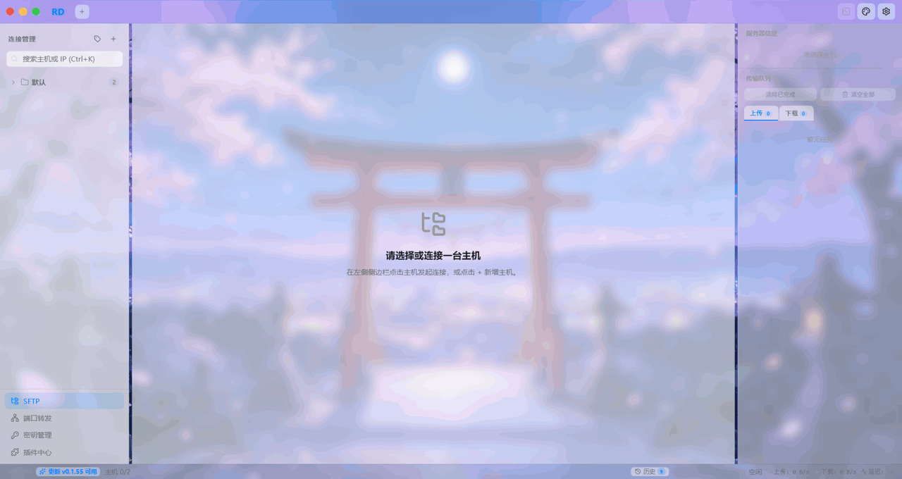

<p align="center">
  
</p>

<h1 align="center">RD — 跨平台 SSH/SFTP 远程文件管理器</h1>

<p align="center">
  面向运维与开发者的双面板远程文件管理器：左侧本地 · 右侧远程 · 服务器硬件监控 · 底部集成终端，多 Tab 切换主机，基于
  <strong>Tauri 2 + Rust + React</strong>
  构建。
</p>

<!-- ========== 徽章 Badges ========== -->
<p align="center">
  <!-- 最新 Release 版本（优先展示，官方动态数据） -->
  <a href="https://github.com/zhangOranges/RD/releases">
    
  </a>
  &nbsp;
  <!-- 当前版本（直接从仓库 package.json 动态读取，无需手动维护） -->
  <a href="CHANGELOG.md">
    
  </a>
  &nbsp;
  <!-- 许可证 -->
  <a href="#许可证">
    
  </a>
  &nbsp;
  <!-- Star -->
  <a href="https://github.com/zhangOranges/RD/stargazers">
    
  </a>
  &nbsp;
  <!-- Issues -->
  <a href="https://github.com/zhangOranges/RD/issues">
    
  </a>
  &nbsp;
  <!-- CI 构建状态（push / PR 语法检查） -->
  <a href="https://github.com/zhangOranges/RD/actions/workflows/ci.yml">
    
  </a>
  &nbsp;
  <!-- Release 构建状态（tag 推送三平台打包） -->
  <a href="https://github.com/zhangOranges/RD/actions/workflows/release.yml">
    
  </a>
</p>

<!-- ========== 平台支持 ========== -->
<p align="center">
  
  &nbsp;
  
  &nbsp;
  
</p>

<!-- ========== 目录 ========== -->
<p align="center">
  <a href="#亮点与差异化优势">亮点</a> ·
  <a href="#界面预览">预览</a> ·
  <a href="#功能特性">功能</a> ·
  <a href="#技术栈">技术栈</a> ·
  <a href="#插件系统">插件</a> ·
  <a href="#下载安装">下载</a> ·
  <a href="#快速开始">快速开始</a> ·
  <a href="#构建">构建</a> ·
  <a href="#许可证">许可证</a>
</p>

---

<!-- ====================================================================== -->
<!-- ✨ 亮点与差异化优势                                                    -->
<!-- ====================================================================== -->
## ✨ 亮点与差异化优势


### 🎯 核心优势

| 维度 | RD | 同类工具（典型对比） |
|---|---|---|
| **包体积** | **约 6–12 MB / 平台**（Tauri 2 原生编译，复用系统 WebView，无 Chromium 内嵌） | Electron 底座 120 MB 起步 |
| **跨平台** | **Windows (.exe) · macOS ARM64 (.dmg) · Linux (.deb / .AppImage)** 三平台统一发布 | 多数仅支持单 / 双平台 |
| **开源免费** | **MIT License，完全免费，无广告，无遥测，无账号** | 付费高级版、强制登录、功能锁定 |
| **性能** | Rust 后端 + Tauri 2，启动 **< 1s**，内存占用低（WebView 共享系统资源） | Electron 内存 200 MB 起步 |
| **隐私安全** | **纯本地运行，零遥测零账号**；凭据 base64 本地存储（非明文）；敏感信息一键打码模糊便于截图分享；日志可随时清空 | 云同步上传、私钥明文传输、强制账号登录 |

### 💎 独有功能

1. **五区一体固定布局**：主机列表 + 本地/远程双面板 + 服务器实时监控 + 传输队列 + 集成终端 Tab — 一站式运维工作台，无需窗口切换
2. **智能断线重连**：网络断开后指数退避自动重连（2s→4s→8s→16s→30s，最多 10 次），网络恢复立即抢先重试；多层面网络检测确保秒级响应；重连成功后终端自动恢复
3. **可视化自定义主题**：5 套预设 + 自定义调色板 + 背景图上传 + **拖拽定位背景图**，启动零闪烁
4. **文件夹压缩传输**：上传/下载文件夹自动本地→压缩→传输→解压，目标目录实时可见临时文件，进度透明
5. **256KB 分片流式传输**：首片即显示进度条/速率，无大文件「卡 10 秒不动」
6. **多主机独立状态**：每个 Tab 独立连接 / 终端 / 本地路径 / 远程路径记忆，切换无干扰
7. **内置多镜像自动更新**：GitHub 直连 + gh-proxy 双镜像并发测速，自动选最快源
8. **PTY 终端深度集成**：目录与文件浏览器自动同步；选中即复制 / 右键即粘贴；拖拽调整面板高度

---

<!-- ====================================================================== -->
<!-- 🎬 界面预览                                                            -->
<!-- ====================================================================== -->
## 🎬 界面预览

<p align="center">
  
</p>

---

<!-- ====================================================================== -->
<!-- 🧰 功能特性                                                            -->
<!-- ====================================================================== -->
## 🧰 功能特性

### 五区固定布局
- **顶部**：全局 TabBar，每个 Tab 对应一个主机，独立连接 / 终端 / 路径状态
- **左侧**：导航侧边栏（主机列表 + 分类管理）
- **中部**：双面板工作区 — 左本地、右远程，支持双向拖拽传输
- **右侧**：功能面板 — 服务器硬件信息、快捷操作、传输队列
- **底部**：集成终端 + 状态栏

### SSH 连接管理
- 多主机管理，支持自定义分类分组（拖拽排序）
- 密码认证与私钥认证（私钥支持 passphrase）
- 凭证本地 base64 编码加密存储
- 实时连接状态跟踪，标签上的状态指示点（已连接 / 连接中 / 重连中 / 未连接）
- **智能断线重连**：网络断开后自动指数退避重连（2s → 4s → 8s → 16s → 30s，最多 10 次、5 分钟超时），网络恢复立即抢先重试
- **多层面网络检测**：Rust SSH 断开事件 + window online/offline + navigator.onLine 轮询 + Rust 健康检查，确保网络变化数秒内被捕获
- 主机复制功能，每个主机独立目录记忆（`path_cache_id`）

### 本地文件面板（左）
- **跨平台兼容**：Windows (`\`) · macOS/Linux (`/`) 路径格式自适应
- 浏览本机任意目录，独立路径记忆（按 `hostId` 隔离，切换 Tab 自动加载对应路径）
- Shift 范围选择 + Ctrl 单选切换，多选右键一键上传到远程
- 面包屑导航支持任意层级跳转

### SFTP 文件浏览器（右）
- 面包屑导航：前进 / 后退 / 上一级，路径历史记录
- 地址栏：双击进入编辑模式，支持绝对路径跳转
- 多选：Shift 范围选择 + Ctrl 单选切换
- 右键上下文菜单：新建文件夹/文件、查看/编辑/重命名/删除/下载
- 拖拽上传：从本地面板拖拽文件 / 文件夹到远程（递归目录上传）
- 虚拟化文件列表（`@tanstack/react-virtual`），数千条目流畅滚动

### 服务器硬件信息（右上角）
连接成功后自动采集并展示：
- **CPU**：型号 + 核心数 + 实时占用率
- **内存**：已用 / 总量 + 百分比进度条
- **磁盘**：已用 / 总量 + 百分比进度条（根分区）
- **系统负载** / **运行时长** / **操作系统**
- 每 15 秒自动刷新，断开重连自动重采

### 集成终端
- 基于 PTY 的完整终端（`xterm.js`），Shell 会话持久化
- 每主机独立显示 / 隐藏状态，持久化到 localStorage
- 自动同步工作目录与文件浏览器（`pty_cd`）
- 右键直接粘贴，选中即复制
- 拖拽手柄调整终端面板大小
- **断线自动恢复**：重连成功后自动重建 PTY shell 会话，无需手动打开终端

### 文件传输
- **上传**：从本地拖拽到远程，或右键多选上传
- **下载**：右键任意文件或文件夹，默认下载到左侧当前目录
- **256KB 分块流式上传**：Rust 后端逐片上报进度，首个分片即显示进度/速率
- **文件夹压缩传输**：本地/远程 `tar.gz` 压缩通道，临时文件位于目标目录，进度透明
- **传输队列**：进度条、百分比、速度（EMA 平滑）、可取消、一键清空、完成后打开所在目录

### 主题系统
- 5 套预设：**tech-dark（黑夜科技，默认）/ dark / light / eye-care-green（护眼绿）/ system**
- 自定义主题编辑器：可视化调整全部调色板字段，支持导入/导出/删除
- 自定义背景图：遮罩透明度 + 面板玻璃透明度两组滑块独立调节
- **背景图拖拽定位**：主题编辑器中可直接拖拽预览图调整位置，一键重置居中
- 启动主题零闪烁（`index.html` 内联脚本首次绘制前注入）

### 自定义窗口与 UI
- 无边框窗口，macOS Sonoma 风格自定义标题栏 + 14×14 圆形交通灯
- Finder 风格视觉，毛玻璃效果（`backdrop-filter`）
- Toast 通知、全局自定义滚动条、cubic-bezier 缓动动画

### 自动更新
- 内置 Tauri updater，Windows / Linux / macOS 三平台
- 启动自动检查，可手动触发
- **多下载源镜像**：GitHub 直连 + `cdn.gh-proxy.org` + `axisnow.gh-proxy.org` 并发测速，自动选最快源

---

<!-- ====================================================================== -->
<!-- 🧩 插件系统                                                              -->
<!-- ====================================================================== -->
## 🧩 插件系统

RD 自带一套三层插件架构（**内核层 / 调度层 / 扩展层**），支持用户通过界面从目录或 `.rdplugin`（zip 包）安装第三方插件，并可在内置插件市场中卸载 / 禁用 / 配置。

### 架构隔离
- **iframe 沙箱**：每个插件运行在独立 `<iframe sandbox="allow-scripts allow-popups allow-downloads allow-same-origin">` 内，不共享主程序 DOM / 全局对象；跨上下文通信通过 `MessageChannel` 端口通道完成，单次调用 60s 超时防悬挂
- **权限声明制**：插件 manifest 需显式声明所需 17 类权限，安装时弹窗展示权限清单与风险等级；用户可随时在设置 → 插件 → 权限中按条撤销或重授
- **存储配额**：插件独立沙箱目录 `{appDataDir}/plugin-data/{id}/store.json`，单值 ≤ 256KB，总存储 ≤ 8MB，单文件写入 ≤ 1MB，超限返回 `STORAGE_QUOTA_EXCEEDED`
- **看门狗 + 内存限额**：每 2s ping iframe，5s 无响应判为卡死并自动禁用；单插件内存 > 200MB（`performance.memory`）自动卸载，不影响其他插件与主程序

### 能力暴露（RD SDK）
通过 `window.__rdPlugin.ctx` 向插件暴露能力，所有 API 前置权限断言：

| 分组 | 主要 API | 对应权限 |
|---|---|---|
| **Server** | `server.listAll/get/create/update/delete/category.*` | `server.read` / `server.write` |
| **Theme** | `theme.getCurrent/listAll/get/apply` | `theme.read` / `theme.apply` |
| **UI** | `ui.notify/confirm/prompt/openPluginView` | `ui.dialog` / `ui.inject-menu` |
| **Storage** | `storage.set/get/remove/removeAll/keys/listFiles` | `storage.read` / `storage.write` |
| **Network** | `http.request/get/post/put/delete`；内网 SSRF 默认拦截 | `network.http` |
| **SSH** | `ssh.exec(cwd, timeout, env)`；友好错误分类与 30s 超时 | `ssh.run`（高危） |
| **SFTP** | `sftp.listDir/stat/mkdir/remove/rename/readFile/writeFile` | `sftp.operate`（高危） |
| **Tunnel** | `tunnel.listRules/addRule/.../exportRules/importRules` | `tunnel.manage`（高危） |
| **Log** | `log.info/warn/error`（同步落盘到 `update.log`） | `log.read` |
| **事件总线** | `onBus('connnection:*'|'tunnel:*'|'sftp:*'|...)` | 按事件分组校验 |

### 安装方式
- **从目录安装**：设置 → 插件 → 已安装 → 「选择目录安装」，选中包含合法 `manifest.json` 的文件夹
- **从 `.rdplugin` 安装**：拖拽 zip 包到插件面板，或点击「安装 .rdplugin 文件」
- **热重载**：已安装插件中开启「监听插件目录（热重载）」开关，修改插件源文件后 500ms 自动销毁并重建实例（manifest 声明 `hotReload: false` 的签名插件不参与）

### 内置插件示例
- **端口转发（rd-native-port-forward）**：内置 SSH 隧道管理插件，支持 local(-L) / remote(-R) / dynamic(-D, SOCKS5) 三种模式；规则导入导出 `.rd-tunnels.json`；remote 模式内建 `GatewayPorts no` 提醒并给出重启 sshd 指令；0.0.0.0 绑定二次确认；连接断开自动关闭；重连成功按 `autoStart` 自动恢复

### 调试与排查
- **iframe 错误横幅**：插件全局 `window.onerror` / `unhandledrejection` 自动转发到主程序并显示错误横幅，给出 plugin_id 和堆栈
- **统一日志落盘**：插件 `console.*`、性能指标、runtime error、卡死 / 内存超限、SDK 调用全部写入 `update.log`（`[Plugin:{id}]` 前缀），可在设置 → 调试中一键打开日志目录

---

### 调试与隐私
- **纯本地运行**：无账号、无云同步、无遥测、无广告，所有数据仅存储在本机
- **凭据安全存储**：密码与私钥以 base64 编码存储在本地文件（非明文），路径 `{data_dir}/ssh-sftp-finder/credentials.json`
- **SSH 指纹验证**：连接时自动获取服务端 SHA-256 指纹，防止中间人攻击
- **敏感信息打码**：设置中开启后，界面中的 IP、端口、用户名、路径等敏感信息自动模糊（blur），便于截图分享；聚焦输入框自动解除打码以便编辑，失焦即恢复
- **本地日志**：详细日志开关（仅本地文件 `update.log`，不联网上传），可在设置面板一键打开日志目录或清空日志

### 快捷键
| 快捷键 | 功能 |
|---|---|
| `Ctrl+,` / `Cmd+,` | 打开设置 |
| <code>Ctrl+\`</code> / <code>Cmd+\`</code> | 切换终端 |
| `F5` / `Ctrl+R` / `Cmd+R` | 刷新当前目录 |
| `Ctrl+S` / `Cmd+S` | 保存文件（文本编辑器中） |
| `Esc` | 关闭弹窗 / 取消编辑 |

---

<!-- ====================================================================== -->
<!-- 📦 下载安装                                                            -->
<!-- ====================================================================== -->
## 📦 下载安装

前往 **GitHub Releases** 页面下载对应平台的最新版安装包：

<p align="center">
  <a href="https://github.com/zhangOranges/RD/releases">
    
  </a>
</p>

| 平台 | 安装包格式 |
|---|---|
| **Windows 10/11 x64** | `.exe`（NSIS 安装器，推荐） |
| **macOS 12+（M 芯片 Apple Silicon）** | `.dmg`（拖拽安装，推荐） |
| **Linux x64（glibc）** | `.deb`（Debian/Ubuntu）· `.AppImage`（通用） |

---

<!-- ====================================================================== -->
<!-- 🏗️ 技术栈                                                              -->
<!-- ====================================================================== -->
## 🏗️ 技术栈

| 层级 | 技术 |
|---|---|
| **前端** | React 19, TypeScript 5.8, Vite 7, Zustand 5 |
| **终端** | xterm.js 6（`@xterm/xterm` + `@xterm/addon-fit`） |
| **UI 图标** | lucide-react |
| **虚拟化列表** | @tanstack/react-virtual |
| **后端** | Rust（edition 2021）, Tauri 2 |
| **SSH 协议** | russh 0.45 |
| **SFTP 协议** | russh-sftp 2.0 |
| **异步运行时** | Tokio（full features） |
| **Tauri 插件** | dialog, fs, clipboard-manager, opener |
| **加密/编码** | sha2, base64, hex（凭证哈希/编码） |

---

<!-- ====================================================================== -->
<!-- 🚀 快速开始                                                            -->
<!-- ====================================================================== -->
## 🚀 快速开始

### 环境要求

- [Node.js](https://nodejs.org/) 22+
- [Rust](https://www.rust-lang.org/tools/install)（stable 工具链）

<details>
<summary>各平台额外依赖</summary>

**Windows**
- WebView2 Runtime（Windows 10/11 已预装）
- MSVC 构建工具（`x86_64-pc-windows-msvc` 目标）

**Linux（Ubuntu/Debian）**
```bash
sudo apt-get install -y \
  libwebkit2gtk-4.1-dev \
  libappindicator3-dev \
  librsvg2-dev \
  patchelf \
  libssl-dev \
  libgtk-3-dev \
  libayatana-appindicator3-dev
```

**macOS**
```bash
xcode-select --install
```
</details>

### 安装与运行

```bash
git clone https://github.com/zhangOranges/RD.git
cd RD
npm install
npm run tauri dev
```

---

<!-- ====================================================================== -->
<!-- 🔨 构建                                                                -->
<!-- ====================================================================== -->
## 🔨 构建

### 本地构建当前平台

```bash
npm run tauri build
# 产物输出：src-tauri/target/release/bundle/
```

### CI / 发布

本项目通过 GitHub Actions 自动构建三平台产物并发布 Release：

| 工作流 | 触发条件 | 内容 |
|---|---|---|
| `ci.yml` | push / PR 到 `main` | 前端 tsc 类型检查 + vite build；Rust `cargo fmt/check/clippy` |
| `release.yml` | push `v*` tag | 三平台矩阵构建（Windows .exe · macOS .dmg · Linux .deb/.AppImage） + 自动生成 Release 与变更日志 |
| `bump-version.yml` | 手动 dispatch | 自动递增版本号 + 推送 commit 与 tag（并行触发 CI + Release） |

```bash
# 创建新版本发布（需先配置 GH_PAT Secret 以触发 Release workflow）
# 方式一：手动打 tag
git tag v0.1.88
git push origin v0.1.88
# 方式二：Actions → Run workflow "Bump Version"（输入 patch/minor/major）
```

---

<!-- ====================================================================== -->
<!-- 📄 许可证                                                              -->
<!-- ====================================================================== -->
## 📄 许可证

本项目基于 **MIT License** 开源 — 详见 [LICENSE](LICENSE) 文件。

---

<!-- ====================================================================== -->
<!-- 🙌 欢迎下载测试                                                          -->
<!-- ====================================================================== -->
## 🙌 欢迎下载测试

<p align="center">
  <strong>如果你是开发者 / 运维 / 重度 SSH 用户，</strong>
  <br>
  欢迎下载最新版本试用，你的反馈就是我们最宝贵的迭代动力 💪
</p>

<p align="center">
  <a href="https://github.com/zhangOranges/RD/releases">
    
  </a>
</p>

<p align="center">
  <a href="https://github.com/zhangOranges/RD/issues/new?assignees=&labels=bug&template=bug_report.md&title=%5BBug%5D">🐞 报 Bug</a>
  &nbsp;·&nbsp;
  <a href="https://github.com/zhangOranges/RD/issues/new?assignees=&labels=enhancement&template=feature_request.md&title=%5BFeature%5D">✨ 提功能建议</a>
  &nbsp;·&nbsp;
  <a href="https://github.com/zhangOranges/RD/discussions">💬 参与讨论</a>
  &nbsp;·&nbsp;
  <a href="https://github.com/zhangOranges/RD">⭐ 点个 Star 支持一下</a>
</p>

<p align="center">
  <sub>如遇到终端、文件传输、跨平台构建、自动更新、主题等任何问题，欢迎提 Issue，我们会尽快响应。</sub>
</p>

<br>
<p align="center">
  用 ❤️ 构建于中国 · RD Team
</p>
