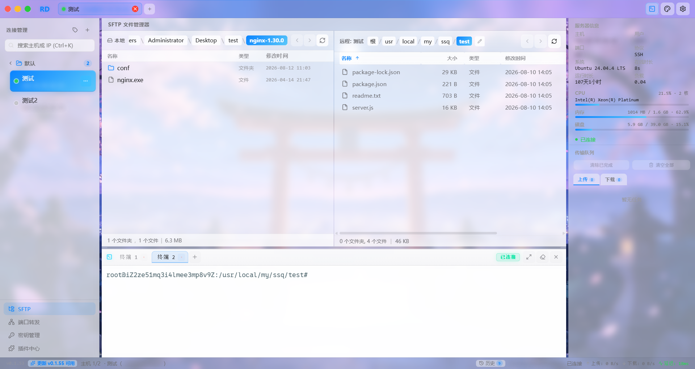
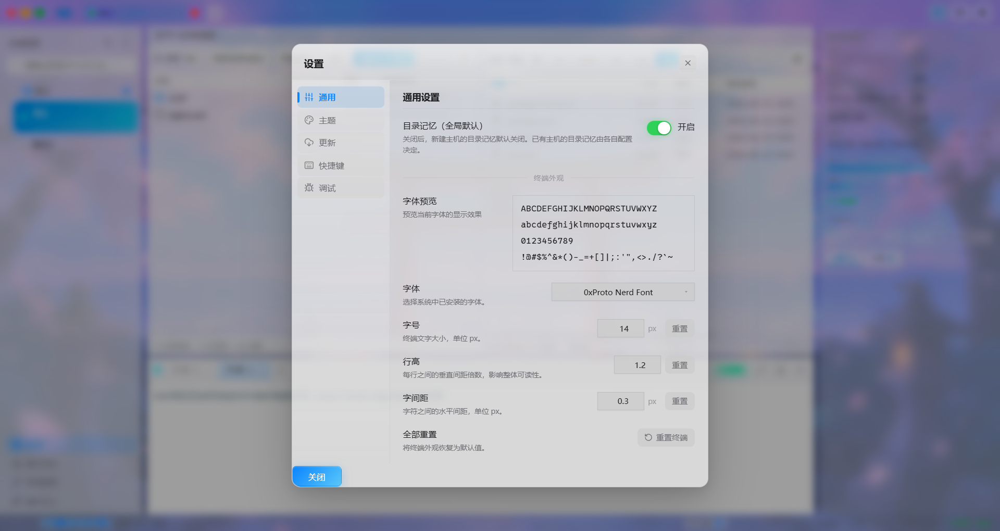
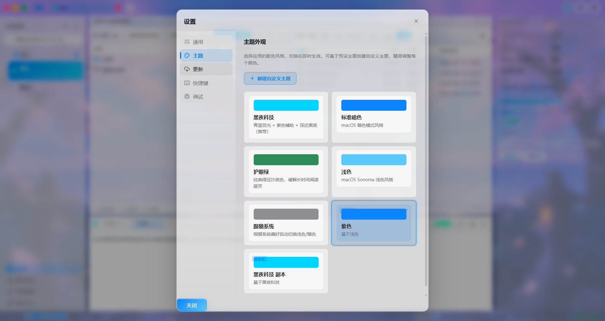
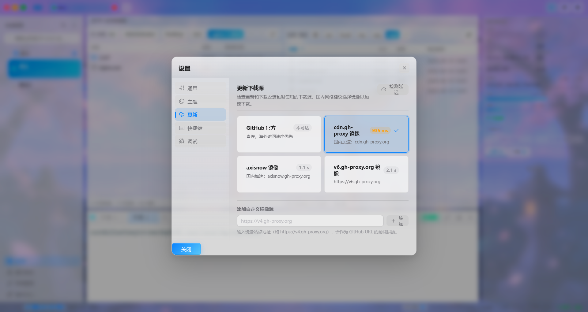
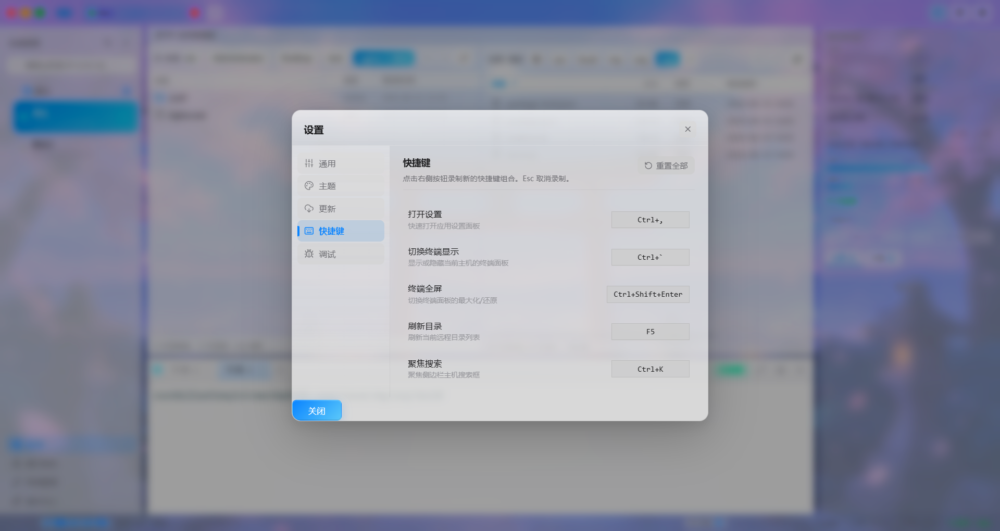
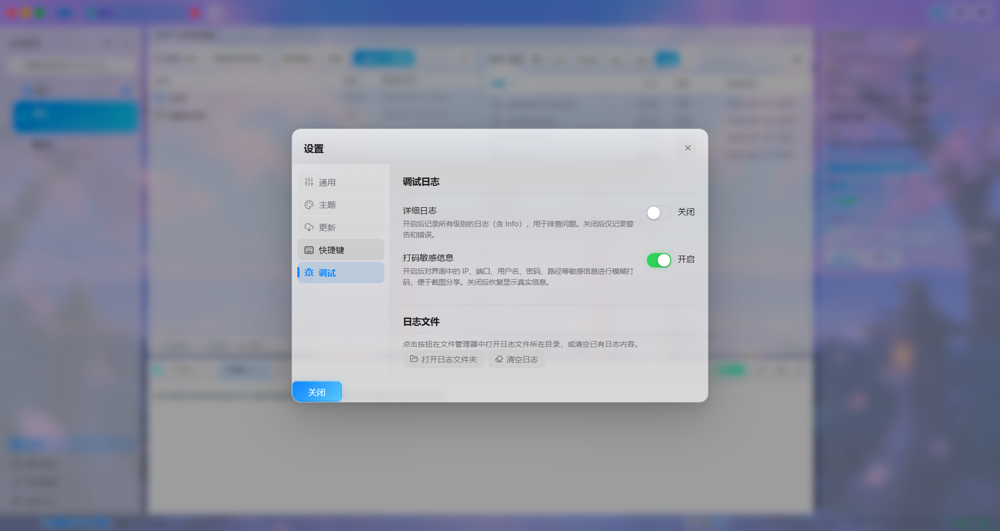

<p align="center">
  
</p>

<h1 align="center">RD — SSH/SFTP 远程文件管理器</h1>

<p align="center">
  一款面向运维与开发者的双面板远程文件管理器：左侧本地 · 右侧远程 · 右上角服务器硬件监控 · 底部集成终端，多 Tab 切换主机，基于 Tauri 2 + React 19 + Rust 构建。
</p>

<p align="center">
  <a href="#功能特性">功能特性</a> ·
  <a href="#技术栈">技术栈</a> ·
  <a href="#快速开始">快速开始</a> ·
  <a href="#构建">构建</a> ·
  <a href="#ci--发布">CI / 发布</a> ·
  <a href="#项目结构">项目结构</a> ·
  <a href="#许可证">许可证</a>
</p>

## 界面预览

<p align="center">
  
</p>


<p align="center">
  
</p>


<p align="center">
  
</p>


<p align="center">
  
</p>


<p align="center">
  
</p>


<p align="center">
  
</p>


<p align="center">
  
</p>


---

## 功能特性

### 五区固定布局
- **顶部**：全局 TabBar，每个 Tab 对应一个主机，独立连接 / 终端 / 路径状态
- **左侧**：导航侧边栏（主机列表 + 分类管理）
- **中部**：双面板工作区 — 左本地、右远程，支持双向拖拽传输
- **右侧**：功能面板 — 服务器硬件信息、快捷操作、传输队列
- **底部**：集成终端 + 状态栏

### SSH 连接管理
- 多主机管理，支持自定义分类分组（拖拽排序）
- 密码认证与私钥认证（私钥支持 passphrase）
- 凭证存储：Windows 下使用 base64 编码的本地文件，keyring 作为备选方案
- 实时连接状态跟踪，标签上的状态指示点
- 主机复制功能，每个主机独立目录记忆（`path_cache_id`）
- 连接成功静默不打断，失败 / 被动断开才弹 Toast 提醒

### 本地文件面板（左）
- 浏览本机任意目录，独立路径记忆（按 `hostId` 隔离，切换 Tab 自动加载对应路径）
- 路径持久化到 `localStorage`，重启后回到上次关闭的目录
- 缓存失效自动降级到用户主目录
- **Shift 范围选择 + Ctrl 单选切换**，多选右键一键上传到远程
- 面包屑导航支持任意层级跳转，无宽度截断

### SFTP 文件浏览器（右）
- **面包屑导航**：前进 / 后退 / 上一级，路径历史记录，任意层级跳转
- **地址栏**：双击进入编辑模式，支持绝对路径跳转
- **多选**：Shift 范围选择 + Ctrl 单选切换，空白处点击清空选中，多选删除 / 下载
- **右键上下文菜单**：
  - 空白区域：新建文件夹 / 新建文件（内联输入，回车确认，ESC 取消）
  - 文件：查看 / 编辑 / 重命名 / 删除 / 下载
  - 文件夹：重命名 / 删除 / 下载
  - 多选状态：菜单文案动态显示「删除已选 N 项」/「上传已选 N 项至远程」
- **拖拽上传**：从本地面板拖拽文件 / 文件夹到远程（递归目录上传）
- **双击行为**：点击文件名文字触发重命名；点击非文字区域打开文本查看器
- **文本查看器 / 编辑器**：只读查看模式，一键切换编辑，`Ctrl+S` 保存，关闭时未保存变更提示
- **目录记忆**：每个主机独立记忆上次访问的远程目录
- 虚拟化文件列表（`@tanstack/react-virtual`），数千条目流畅滚动
- 自定义滚动条（细条覆盖式，跟随主题色，Firefox 兼容）

### 服务器硬件信息（右上角）
连接成功后自动采集并展示：
- **CPU**：型号 + 核心数 + 实时占用率（采样 `/proc/stat` 两次差值计算）
- **内存**：已用 / 总量 + 百分比进度条
- **磁盘**：已用 / 总量 + 百分比进度条（根分区）
- **系统负载**：1 分钟平均负载
- **运行时长**：实时更新的 uptime
- **操作系统**：`/etc/os-release` 解析
- 每 15 秒自动刷新，断开重连自动重采

### 集成终端
- 基于 PTY 的完整终端（`xterm.js`），Shell 会话持久化
- **每主机独立的显示 / 隐藏状态**，状态按 `hostId` 持久化到 `localStorage`，二次打开沿用上次设置
- 自动同步工作目录与文件浏览器（`pty_cd`）
- **右键直接粘贴**（无菜单，直接写入剪贴板内容），选中即复制
- 拖拽手柄调整终端面板大小，自动适配终端尺寸
- Shell 历史记录清洁：内部命令以空格前缀 + `HISTCONTROL=ignorespace` 排除
- 面板隐藏时保留终端快照（CSS `display: none`，不卸载 xterm 实例和 PTY 会话）

### 文件传输
- **上传**：从本地面板拖拽文件 / 文件夹到远程，或右键多选上传
- **下载**：右键任意文件或文件夹，默认下载到**左侧本地面板当前打开的目录**，无需弹框选择
- **256KB 分块流式上传**：Rust 后端逐片读取本地文件 + 逐片上报进度，第一个分片起进度条 / 速率即开始动（避免大文件 10s 延迟）
- **文件夹压缩传输**（针对文件夹，自动走压缩通道，无需用户干预）：
  - **上传文件夹**：本地先调用 `tar` 压缩为 `.tar.gz`，压缩包直接生成在远程目标目录（`.tmp` 后缀，传输过程中可见），上传完成后自动重命名为正式压缩包名，远程解压，清理远程压缩包
  - **下载文件夹**：远程先调用 `tar` 压缩为 `.tar.gz`，下载到本地目标目录（`.tmp` 后缀，传输过程中可见且文件大小实时增长），下载完成后自动重命名为正式压缩包名，本地解压，清理本地压缩包
  - 临时文件全程位于目标目录中，用户能直观看到传输进度
- **传输队列**（右侧面板内嵌）：
  - 实时进度条、百分比、已传大小、传输速度（EMA 平滑）、耗时
  - 可取消进行中的传输（Rust 端取消令牌机制）
  - 下载完成后提供「打开所在文件夹」按钮
  - 一键清空全部任务（含进行中）
  - 自定义垂直滚动条，与远程目录列表样式一致
  - 发起上传/下载时自动切换到对应 Tab

### 主题系统
- 5 套预设主题：**tech-dark（黑夜科技，默认）/ dark / light / eye-care-green（护眼绿）/ system（跟随系统）**
- **自定义主题编辑器**：基于任意预设主题创建自定义主题，可视化调整全部调色板字段（背景/文字/终端配色/分割线/阴影/圆角等），改动即时注入预览，支持导入/导出/删除
- **自定义背景图**：支持上传本地图片作为应用背景，提供「遮罩透明度」与「面板玻璃透明度」两组滑块独立调节，平衡背景图可见性与文字可读性
- **背景图拖拽定位**：在主题编辑器中可直接拖拽预览图调整背景图在窗口中的显示位置，一键重置居中
- 通过 `data-theme` 属性切换，立即生效；自定义主题通过 `adoptedStyleSheets` 运行时注入，优先级高于预设
- 用户选择持久化到 `localStorage`，重启沿用
- 启动时主题在首次绘制前即生效（`index.html` 内联脚本提前注入），无主题闪烁
- 背景图上传时自动压缩，保存前预检 `localStorage` 容量并在超限时提示

### 自定义窗口
- 无边框窗口，自定义 macOS Sonoma 风格标题栏
- 14×14px 圆形交通灯按钮（关闭 / 最小化 / 最大化），关闭按钮常态淡红、hover 实红显 ×
- 标签页关闭按钮采用相同 macOS 红绿灯风格：常态淡红圆点、hover 显白 ×
- 工具栏通过 `-webkit-app-region: drag` 实现拖动（交互元素标记 `no-drag`）
- 窗口原生 `backgroundColor` 配置为深色底，避免启动瞬间白闪

### 启动加载体验
三层 splash 无缝衔接，避免空白黑面板：
1. **原生窗口层**：Tauri 窗口 `backgroundColor` 即时着色
2. **HTML 预渲染层**：`index.html` 内联 RD 渐变图标 + 旋转加载环 + 「正在加载…」，React 渲染前就可见
3. **应用就绪层**：React 内 splash 接管，直到主机列表 / 设置加载完成

### UI / 用户体验
- macOS Finder 风格视觉设计，毛玻璃效果（`backdrop-filter`）
- 蓝青色渐变点缀、终端霓虹边缘、径向环境光
- Toast 通知（成功 / 错误 / 警告 / 信息）
- 全局禁用浏览器右键菜单（不允许出现刷新等原生菜单）
- 全局自定义滚动条样式，所有面板视觉一致
- 弹窗 / 上下文菜单统一通过 React Portal 挂载到 `document.body`，避免 `backdrop-filter` 堆叠上下文问题
- 全局 cubic-bezier 缓动动画

### 快捷键
| 快捷键 | 功能 |
|---|---|
| `Ctrl+,` / `Cmd+,` | 打开设置 |
| `Ctrl+`` ` / `Cmd+`` ` | 切换终端 |
| `F5` / `Ctrl+R` / `Cmd+R` | 刷新当前目录 |
| `Ctrl+S` / `Cmd+S` | 保存文件（文本编辑器中） |
| `Esc` | 关闭弹窗 / 取消编辑 |
| `Enter` | 确认重命名 / 新建文件夹名 |

---

## 自动更新

- 内置更新器（Tauri updater），支持 Windows / Linux / macOS 三平台
- 启动时自动检查，可在「设置 → 更新」手动触发
- **多下载源镜像**：内置 GitHub Release 直连 + `cdn.gh-proxy.org` + `axisnow.gh-proxy.org`，启动时并发测速，默认选择延迟最低的镜像
- 发现新版本弹框中实时展示各镜像源的延迟（绿色 < 300ms / 黄色 300–1000ms / 灰色超时），用户可手动切换
- 支持预发布版本（`beta`）

---

## 调试与隐私

### 调试日志
- 在「设置 → 调试」中可切换**详细日志**开关
- 开启后，应用会将 SSH 连接、SFTP 操作、PTY 会话、存储读写等关键路径的 debug 级别日志写入本地日志文件
- 关闭详细日志时仅记录警告和错误级别
- 「打开日志文件夹」一键跳转到日志目录（Fire-and-forget，无弹窗打扰）
- 「清空日志」一键清理历史日志内容
- 日志文件用于排查问题，建议出现异常时再开启

### 打码敏感信息
- 在「设置 → 调试」中可切换**打码敏感信息**开关
- 开启后对界面中的 IP 地址、端口、用户名、密码、私钥、文件路径等敏感信息进行模糊打码，便于截图分享
- 打码覆盖范围：右上角服务器信息、左侧主机列表、顶部标签页地址、底部状态栏、地址栏路径、主机编辑对话框
- 输入框打码时聚焦自动恢复可见以便编辑，失焦后恢复打码
- 开关切换即时生效，无需重启

---

## 技术栈

| 层级 | 技术 |
|---|---|
| **前端** | React 19, TypeScript 5.8, Vite 7, Zustand 5 |
| **终端** | xterm.js 6（`@xterm/xterm` + `@xterm/addon-fit`） |
| **UI 图标** | lucide-react |
| **虚拟化列表** | @tanstack/react-virtual |
| **后端** | Rust（edition 2021）, Tauri 2 |
| **SSH 协议** | russh 0.45 |
| **SFTP 协议** | russh-sftp 2.0 |
| **异步运行时** | Tokio（full features） |
| **Tauri 插件** | dialog, fs, clipboard-manager, opener |
| **加密/编码** | sha2, base64, hex（凭证哈希/编码） |

---

## 快速开始

### 环境要求

- [Node.js](https://nodejs.org/) 22+
- [Rust](https://www.rust-lang.org/tools/install)（stable 工具链）
- 各平台依赖：

<details>
<summary>Windows</summary>

- WebView2 Runtime（Windows 10/11 已预装）
- MSVC 构建工具（`x86_64-pc-windows-msvc` 目标）
</details>

<details>
<summary>Linux（Ubuntu/Debian）</summary>

```bash
sudo apt-get install -y \
  libwebkit2gtk-4.1-dev \
  libappindicator3-dev \
  librsvg2-dev \
  patchelf \
  libssl-dev \
  libgtk-3-dev \
  libayatana-appindicator3-dev
```
</details>

<details>
<summary>macOS</summary>

- Xcode Command Line Tools：`xcode-select --install`
</details>

### 安装与运行

```bash
# 克隆仓库
git clone https://github.com/your-username/rd.git
cd rd

# 安装 npm 依赖
npm install

# 启动开发服务器（自动打开 Tauri 开发窗口）
npm run tauri dev
```

---

## 构建

### 本地构建

```bash
# 构建当前平台的生产版本
npm run tauri build

# 安装包和可执行文件输出目录：
#   src-tauri/target/release/bundle/
```

### 交叉编译

交叉编译由 GitHub Actions 处理（见下文）。本地构建可指定目标平台：

```bash
# Windows
npm run tauri -- build --target x86_64-pc-windows-msvc

# Linux
npm run tauri -- build --target x86_64-unknown-linux-gnu

# macOS（Apple Silicon）
npm run tauri -- build --target aarch64-apple-darwin
```

---

## CI / 发布

本项目包含两个 GitHub Actions 工作流：

### CI（`.github/workflows/ci.yml`）
在 push/PR 到 `main` 分支时触发：
- **前端**：`tsc --noEmit` 类型检查 + `vite build` 构建
- **Rust（Linux）**：`cargo fmt --check` + `cargo check --locked` + `cargo clippy -D warnings`
- **Rust（Windows）**：在 `x86_64-pc-windows-msvc` 目标上执行 `cargo check`

### 发布（`.github/workflows/release.yml`）
在推送 `v*` 标签时触发：
- **三平台矩阵并行构建**（`fail-fast: false`，互不影响）：

| 平台 | Runner | 编译目标 | 产物 |
|---|---|---|---|
| Windows x64 | `windows-latest` | `x86_64-pc-windows-msvc` | `.msi`、`.exe`（NSIS 安装器）、portable `.exe` |
| Linux x64 | `ubuntu-22.04` | `x86_64-unknown-linux-gnu` | `.deb`、`.rpm`、`.AppImage` |
| macOS ARM64 | `macos-latest` | `aarch64-apple-darwin` | `.dmg`、`.app.tar.gz` |

- 预编译 tauri-cli：各平台直接下载官方预编译二进制，跳过源码编译
- 两级缓存策略：Rust 增量编译缓存 + npm 依赖缓存，合并 cargo bin 目录，显著提升二次构建速度
- 自动创建 GitHub Release 并生成变更日志
- 标签名包含 `-`（如 `v0.1.0-beta`）自动标记为预发布
- 可选的 Tauri 更新签名（通过 `TAURI_SIGNING_PRIVATE_KEY` 密钥配置）

```bash
# 创建发布
git tag v0.1.0
git push origin v0.1.0
# → GitHub Actions 自动构建三平台产物并发布 Release
```

---

## 项目结构

```
rd/
├── src/                          # 前端（React + TypeScript）
│   ├── components/
│   │   ├── AddressBar.tsx        # 远程面包屑导航 + 路径编辑
│   │   ├── ContentArea.tsx       # 主内容区编排（双面板 + 终端）
│   │   ├── FileBrowser.tsx       # 远程 SFTP 文件列表、多选、右键菜单、拖拽
│   │   ├── HostDialog.tsx        # 新增/编辑主机配置
│   │   ├── LocalFilePane.tsx     # 本地文件面板（多选、右键上传、拖拽到远程）
│   │   ├── QuickActions.tsx      # 右上角快捷操作面板
│   │   ├── RightPanel.tsx        # 右侧功能面板容器
│   │   ├── ServerInfo.tsx        # 服务器硬件信息（CPU/内存/磁盘/负载）
│   │   ├── SettingsDialog.tsx    # 应用设置 + 主题 + 更新 + 调试 + 打码开关
│   │   ├── Sidebar.tsx           # 主机列表 + 分类管理
│   │   ├── StatusBar.tsx         # 底部状态栏
│   │   ├── TabBar.tsx            # 顶部全局标签栏 + 窗口控制
│   │   ├── TerminalPanel.tsx     # xterm.js 终端 + PTY
│   │   ├── TextEditorDialog.tsx  # 文件查看器/编辑器
│   │   ├── ThemeEditor.tsx       # 自定义主题编辑器（调色板 + 背景图）
│   │   ├── TransferQueue.tsx     # 传输队列（右侧内嵌）
│   │   ├── TransferNotification.tsx  # 传输通知徽标
│   │   └── Toast.tsx             # Toast 通知系统
│   ├── store/
│   │   ├── fileStore.ts          # 远程 SFTP 文件操作 + 多选状态
│   │   ├── hostStore.ts          # SSH 主机/连接状态
│   │   ├── localFileStore.ts     # 本地文件操作 + 按 hostId 路径记忆
│   │   ├── themeStore.ts         # 主题状态 + localStorage 持久化
│   │   ├── transferStore.ts      # 传输任务跟踪 + 进度事件
│   │   └── uiStore.ts            # UI 状态（面板尺寸、终端可见性按 hostId、打码模式）
│   ├── theme/
│   │   └── palette.ts            # 主题调色板数据模型 + 预设主题 + 自定义主题继承
│   ├── utils/
│   │   └── uploadFromLocal.ts    # 本地→远程上传（分块读取、压缩上传、覆盖策略）
│   ├── styles/
│   │   ├── finder.css            # 全局 + 主题变量 + 工具栏 + 状态栏 + 弹窗
│   │   ├── filebrowser.css       # 远程文件浏览器 + 地址栏样式
│   │   ├── localfile.css         # 本地文件面板样式
│   │   ├── rightpanel.css        # 右侧面板（服务器信息/快捷操作/传输队列）
│   │   ├── tabbar.css            # 顶部标签栏 + 窗口控制 + 关闭按钮
│   │   ├── terminal.css          # 终端面板样式
│   │   └── transfer.css          # 传输通知样式
│   └── types/
│       └── index.ts              # 共享 TypeScript 类型定义
├── src-tauri/                    # 后端（Rust + Tauri）
│   ├── src/
│   │   ├── ssh/                  # SSH 连接（russh）
│   │   │   ├── connection.rs     # 连接生命周期 + 认证
│   │   │   ├── exec.rs           # SSH exec 通用命令 + 服务器硬件信息采集
│   │   │   ├── handler.rs        # 客户端 handler + 断连事件
│   │   │   └── error.rs          # SSH 错误类型
│   │   ├── sftp/                 # SFTP 操作（russh-sftp）
│   │   │   ├── mod.rs            # 命令：列表、读取、写入、分片上传、
│   │   │   │                     #   下载文件/目录、取消传输等
│   │   │   ├── error.rs          # SFTP 错误类型 + 映射
│   │   │   └── model.rs          # SFTP 会话状态管理
│   │   ├── pty/                  # PTY 终端会话
│   │   │   ├── mod.rs            # pty_open、pty_write、pty_cd 命令
│   │   │   ├── session.rs        # Shell 会话生命周期
│   │   │   └── parser.rs         # 输出解析（cwd 检测）
│   │   ├── storage/              # 本地持久化
│   │   │   ├── hosts.rs          # HostConfig 增删改查
│   │   │   ├── credentials.rs    # 凭证存储（base64 文件）
│   │   │   ├── categories.rs     # 主机分类管理
│   │   │   ├── path_cache.rs     # 目录记忆（按主机）
│   │   │   └── settings.rs       # 应用设置持久化
│   │   └── local_fs.rs           # 本地文件系统操作（分块读取、压缩、解压、重命名、删除等）
│   │   ├── lib.rs                # Tauri 命令注册 + 插件初始化
│   │   └── main.rs               # 入口
│   ├── capabilities/
│   │   └── default.json          # Tauri 2 权限配置
│   ├── icons/                    # 应用图标（全平台）
│   ├── Cargo.toml                # Rust 依赖
│   ├── tauri.conf.json           # Tauri 配置
│   └── build.rs                  # Tauri 构建脚本
├── .github/workflows/
│   ├── ci.yml                    # CI：类型检查 + cargo check + clippy
│   └── release.yml               # 发布：三平台矩阵构建
├── .gitignore
├── package.json
├── tsconfig.json
├── vite.config.ts
└── README.md
```

---

## 许可证

本项目基于 MIT 许可证开源 — 详见 [LICENSE](LICENSE) 文件。
